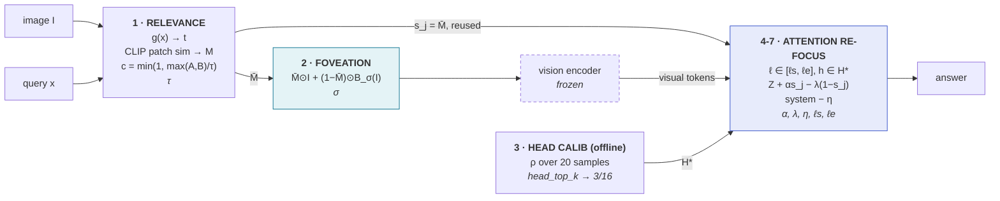

# SRF Method Details

> **START HERE if you are a new session.** This file is the single most current
> record of the method, the code, and what has been measured. The files under
> `lmms-eval/srf/docs/` are older and partly superseded. Where they disagree with
> this file, this file is newer. Read the "Where things stand" block below first.

## Where things stand (as of 2026-09-18)

**READ SECTION 7 FIRST**, and **SECTION 8 if you are running LLaVA on a cluster**
(it starts with two blockers that will otherwise waste GPU hours). It has the current command, the pipeline, every mode
and hyperparameter, the latest ablation and the known traps.

**Method status.** Seven components, eight parameters, notation settled as
`tau`, `sigma`, `k`, `[ls,le]`, `lambda_sem`, `lambda_bg`, `lambda_sys`
(see the budget table below). No component or parameter default has been changed
in the shipped path. Several alternatives were built and measured but NOT adopted.

**Headline MMVP numbers (Qwen2.5-VL-3B, 150 pairs, 1 pair = 0.67pp).**
baseline 40.00, full SRF 43.33, and essentially every variant tried lands in
42.67-44.67. See 5.1.

**The blocking problem.** Almost all MMVP differences measured this session are
1-4 pairs, i.e. below the resolution of the benchmark. **McNemar tests and
bootstrap CIs are the top priority** and need no GPU. Until they exist, no
MMVP-only comparison in this range should be acted on.

**Decisions made.**
- `phase` unification tested and REVERTED, per-dataset setting kept (5.5)
- S5 joint slot selection NOT adopted (5.3)
- S1 preferred over S3 on correctness grounds, neither validated beyond MMVP (3.5b)
- `lambda_bg` and `lambda_sys` NOT deleted, they are weak but non-null (5.1, 4.5)

**Open questions in priority order.** See 5.7.

**Paper artifacts.** `PAPER/ICLR/appendix.tex` (ablation + sensitivity section,
not yet `\input` into PAPER.tex), `PAPER/ICLR/tables/ablation_components_mmvp.tex`,
`PAPER/ICLR/tables/param_sensitivity_mmvp.tex`. Both tables are generated from
result JSONs, regenerate rather than hand-editing.

**Known repo hazard.** `srf/head_calibration.py` writes
`results/ablation/head_calibration_<dataset>_qwen3b.json` with a fixed name, so a
later single-mode run OVERWRITES earlier modes. This already happened once.
Recover from the `/tmp/*.log` files or re-run.

---

Living reference. One section per component: maths, functions, which mode to run,
commands and numbers. Keep entries short.

- Repo `/volumes2/mllm/lmms-eval` · Env `source activate mllm`
- Paper `/volumes2/mllm/PAPER/ICLR/PAPER.tex`
- Figure https://claude.ai/code/artifact/ee20796d-2360-4fc8-97ce-7614f10fecc9
- Model for all numbers: `Qwen/Qwen2.5-VL-3B-Instruct` (36 layers, 16 heads/layer)

| # | Component | Status |
|---|---|---|
| 1 | Semantic relevance map | paper mode built, POPE not run |
| 2 | Semantic foveation | **in progress** |
| 3 | Head + layer selection | **in progress** (merged, see 3) |
| 4 | Amplification `alpha` | not started |
| 5 | Attenuation `lambda` | deletion candidate, 0.00pp |
| 6 | System suppression `eta` | deletion candidate, 0.00pp |

**Budget under paper spec:** 8 params.

| Symbol | Stage | Role | Default |
|---|---|---|---|
| `tau` | 1 relevance | presence threshold | 0.20 |
| `sigma` | 2 foveation | blur scale, pixels | 20 |
| `k` | 3 targeting | head fraction per layer | 0.20 |
| `[ls, le]` | 3 targeting | fusion-layer interval | [8,16] |
| `lambda_sem` | 4 re-focus | amplify relevant image tokens | 2.0 |
| `lambda_bg` | 4 re-focus | attenuate background image tokens | 0.2 |
| `lambda_sys` | 4 re-focus | suppress system-prompt tokens | 0.30 |

Tunable `lambda_sem`, `sigma`, `[ls,le]`. Fixed `tau`, `k`, `calib_n`=20.
Cut candidates `lambda_bg`, `lambda_sys`. A notation table like this belongs in
the paper's method section too.

**Planned appendix tables (3).**

1. **Component ablation** — one component added at a time. Must start from
   uniform boost, because the semantic map is an *input*, not an intervention:
   removing it leaves baseline, so it can only be ablated by replacement.
2. **Parameter sensitivity** — `alpha`, `sigma`, `tau`, `head_top_k`, layer
   interval as curves; the rest tabular. Run after components are settled.
   Sweep `sigma` at `tau`=0.2 (where c=1, so they decouple) and sweep `tau` on
   POPE, since c is inert on MMVP.
3. **Random controls** — random semantic map, random blur map, random layers,
   random heads, each matched in cardinality to the real thing. This is the
   table that separates "blurring/boosting helps" from "*semantic*
   blurring/boosting helps". Partly implemented in `srf/eval_ablation.py`.
   Warning: the June VLMBias run gave SRF 15.45 vs random saliency 15.41.

---

## Method flow



One relevance map, computed once, consumed twice. Head calibration is offline.
No extra decoder forward pass anywhere.

---

## 1. Semantic relevance map

**Output.** `M` = one continuous float per visual token, in [0,1]. Not binary.

```
83 crops (3x3 + 5x5 + 7x7) -> cosine sim vs target text
  -> upsample each scale to token grid, min-max normalise each to [0,1]
  -> elementwise MAX over the 3 scales -> min-max normalise -> M
c    = min(1, max(A, B) / tau)            A = full-image sim, B = best-patch sim
Mbar = c*M + (1-c)*1                      c=1 -> M ; c=0 -> all ones
```

Because of min-max normalisation, `M` always spans the full [0,1] with a token at
0 and a token at 1, regardless of absolute similarity. `M` therefore carries no
confidence information, which is why `c` must exist separately.

`Mbar` is used at two resolutions: token grid for the decoder `s_j`, and
bilinearly upsampled to `H x W` for foveation.

**Paper vs shipped `clip_full_gate_v3`** (three code-only divergences):

| | Paper | v3 |
|---|---|---|
| Decision | soft `c` only | hard `(A>=0.20) OR (B>=0.27)` |
| `c` numerator | `max(A,B)` | **A only** |
| Effect of `c` | via `Mbar` only | **`alpha_eff = alpha*c`**, raw `M` |
| Low conf | `Mbar->1`: uniform boost, zero attenuation | `mask=None`: nothing |

`max(A,B)>=tau <=> (A>=tau) OR (B>=tau)`, so the gate form is nearly the paper's.
The real bug is `alpha*c`: in `qwen_attn_patch.py` the bias row is
`alpha_val*sal - eps*(1-sal)`, and `c` scales `alpha_val` but not `eps`, so low
confidence weakened "look here" while keeping "ignore there" at full strength.

**Functions.**

```
eval.py::run_* -> method_mod.prepare_sample(inp, s, e, image, question, model, processor)
srf.py::prepare_sample
   noun_extract.extract_clip_noun(question, mode=_noun_mode)
   _BAD_NOUNS gate -> _STATE["method"]="baseline" (SRF OFF for that sample)
   dispatch on SALIENCY["saliency_mode"] -> writes _STATE["salience_mask"], ["value"]
clip_salience.py::compute_clip_salience_full_gate_v3(...) -> ClipSalienceResult
clip_salience.py::get_grid_dims(inputs, spatial_merge_size)
```

**Modes** (`--saliency_mode`). Twelve exist; only these matter.

| Mode | Use |
|---|---|
| `clip_full_gate_v3` | shipped default, produced all published numbers |
| `clip_full_gate_v3_paper` | implements the paper, added 2026-09-17 |
| `clip` | single-scale 49 crops. Better on MMVP (+2.67pp), worse on POPE |

**Dead / broken.**

- `clip_soft_gate` is a **no-op**: `w*spatial+(1-w)*0.5` then min-max renormalise,
  and min-max is affine-invariant. Verified, max deviation 1e-6.
- `clip_top_k_pct` dead (only builds the unused `result.mask`; `clip_use_soft`
  hardcoded True). Explains `MMVP.md`'s "insensitive" sweep.
- `clip_coarse_grid` dead under v3 (scales come from the function default).
- `neg_absent_alpha` (2.0, POPE only) is not in the paper; unreachable in paper mode.

**Results.** MMVP at the published anchor (`alpha=2.0, eps=0.2, [8,16], sigma=20`):

```bash
source activate mllm && stdbuf -oL -eL python -u srf/eval.py \
  --method srffovea --datasets mmvp --saliency_mode clip_full_gate_v3_paper \
  --output results/v3paper_mmvp/ 2>&1 | tee /tmp/v3paper_mmvp.log
```

| Mode | Pair | Img |
|---|---|---|
| `clip_full_gate_v3` | 43.33 | 69.67 |
| `clip_full_gate_v3_paper` | **44.00** | **70.33** |

`c = 1.000 on all 300 MMVP samples` (frac(c<1) = 0.00), so `Mbar = M` and the
whole-image fallback never fires. **c is provably inert on MMVP.** +0.67pp is one
pair out of 150, i.e. noise: this is a correctness and parameter win, not an
accuracy win. Small because `alpha` sits on a plateau (`MMVP.md`: 4.0 == 5.0).

v3 gate drop rates (from `head_calibration.py` mode `saliency`): MMVP 14/20
survive, VLMBias 19/20.

Older paired MMVP runs, `layer_end=15` (`results/srf_base_best/`): `clip` 42.00,
v3 39.33, v3 at tau=0.10 39.33.

**Open.**

1. **POPE not run and it is decisive** — the only benchmark with genuinely absent
   objects. Paper mode gives absent -> c->0 -> uniform boost, zero attenuation;
   v3 gave no intervention plus `neg_absent_alpha=2.0` suppression.
   ```bash
   source activate mllm && stdbuf -oL -eL python -u srf/eval.py \
     --method srf --datasets pope --pope_splits adversarial \
     --saliency_mode clip_full_gate_v3_paper \
     --output results/v3paper_pope/ 2>&1 | tee /tmp/v3paper_pope.log
   ```
2. **How to set `tau` generically** — see below. Unresolved.
3. Bad-noun fallback disables SRF; the paper says fall back to a broader prior,
   i.e. `c=0`. Not yet changed.
4. VLMBias / MME / MMHal-Bench not run in paper mode.

### 1.x Setting `tau` — the open problem

`tau` is **not calculated**. It is the constant 0.20, from a 60-sample POPE val
sweep (code comment: t=0.21 -> acc 0.817). It is an **absolute** CLIP cosine
similarity threshold, and that is why it cannot be generic:

- CLIP similarities are uncalibrated. The code already admits this with per-model
  tables: `_MODEL_ABSENCE_THRESH` is 0.20 for ViT-B/32 but **0.06 for SigLIP**, a
  3x difference for the same task.
- Absolute similarity also shifts with image distribution (photos vs chess boards
  vs flags vs optical illusions) and with noun specificity.
- Under the paper's formula `tau` now thresholds `max(A,B)`, not `A`, so the old
  60-sample sweep does not even apply to it.

Options, cheapest first:

| Option | Idea | Cost |
|---|---|---|
| **A. delete `c`** | c=1.000 everywhere on MMVP already. If POPE also shows no effect, drop `c` and `tau` -> semantic map has **zero** parameters | 1 POPE run |
| B. derive from calib set | set `tau` from the distribution of `max(A,B)` over the 20 unlabelled calibration samples already used for head calibration. Scale-free across models and datasets; replaces an absolute constant with a percentile | 1 code change + reruns |
| C. scale-free statistic | replace `max(A,B)/tau` with a ratio already computed in v3, e.g. `patch_contrast = top30%_mean / all_mean` (`_CONTRAST_THRESH=1.40`), or the noun-vs-neutral contrastive gap | bigger change |
| D. per-dataset `tau` | tune per benchmark | rejected, defeats genericity |

**Recommendation: test A first.** `c` is inert on MMVP, so its entire value lives
in POPE-like absent-object cases. One POPE run with `c` active vs `c` forced to 1
decides whether `tau` needs solving at all. If `c` is also inert on POPE, delete
it and the whole question disappears.

---

## 2. Semantic foveation

**What it does.** Blurs the image *before* the vision encoder, keeping
query-relevant regions sharp.

```
I_SRF = Mbar (*) I + (1 - Mbar) (*) B_sigma(I)      elementwise over colour channels
v     = E_v(I_SRF)
```

`Mbar` at token-grid resolution is bilinearly upsampled to `H x W` first. High
`Mbar` keeps original pixels, low `Mbar` takes Gaussian-blurred pixels. Background
is **attenuated, not removed**, which is the claim the sweep below supports.

**Parameter:** `sigma` only (Gaussian blur radius in pixels). Default 20.

**Functions.**

```
srf/srf_fovea.py
  setup / reset_for_dataset / cleanup   re-exported unchanged from srf.py
  SIGMA = 20.0                          module-level, read at call time
  prepare_sample(inp, ...)
    1. srf.prepare_sample(...)                        -> _STATE["salience_mask"]
    2. clip_salience.get_grid_dims(inp, _SPATIAL)     -> grid_h, grid_w
    3. _saliency_to_weight(mask, W, H, grid_h, grid_w) -> (H,W) float weight map
    4. _apply_foveal_blur(image, weight, SIGMA)        -> PIL foveated image
    5. _replace_pixel_values(inp, fovea_img, processor) -> overwrites inp["pixel_values"]
```

Dispatched by `eval.py --method srffovea` (`eval.py:967`).

**Five silent no-op paths** in `prepare_sample`, none logged: `salience_mask is
None`; `get_grid_dims` raises; `blur_weight is None`; processor call raises;
re-processed shape differs from the original. If foveation appears to do nothing,
check these before anything else.

**Results.** MMVP sigma sweep, 150 pairs, all under `clip_full_gate_v3`
(`srf/docs/EXPERIMENTS.md`, script `srf/test_srffovea_mmvp.py`):

```bash
source activate mllm && python srf/test_srffovea_mmvp.py --sigma 20 30 50 100 \
  2>&1 | tee /tmp/srffovea_all.log
```

| sigma | fovea only | + SRF attention |
|---|---|---|
| — | baseline 40.00 | srf 41.33 |
| 3 | 37.33 | 38.67 |
| 5 | 35.33 | 37.33 |
| 10 | 38.67 | 39.33 |
| **20** | 41.33 | **43.33** |
| **30** | **43.33** | 42.67 |
| 50 | 42.67 | 42.67 |
| 100 | 40.00 | 41.33 |

RePOPE adversarial (100 samples): neutral at sigma<=20 (95.00), degrades from
sigma=50 (92.00–93.00). VLMBias: roughly neutral, 19.6 vs 19.7 for SRF base.

**Open.**

1. **`fovea_30` alone (43.33) equals `srffovea_20` (43.33), and adding attention
   at sigma=30 makes it worse (42.67).** Read literally, the decoder stage
   contributes nothing on MMVP and blur alone is the whole effect. This is the
   strongest objection to the two-stage story and must be addressed, not omitted.
2. **The entire sweep was run under `clip_full_gate_v3`**, whose `alpha*c` throttle
   we now know halved the decoder boost. So the sweep systematically understated
   the attention stage. **Re-run under `clip_full_gate_v3_paper` before drawing
   any conclusion about point 1.**
3. Non-monotonic in `sigma` with a plateau at 20–50; needs an explanation in the
   paper, not just a chosen value.
4. Task-specific: helps MMVP, neutral on RePOPE and VLMBias, hurts at large
   `sigma`. Genericity across all five benchmarks is unestablished.
5. `sigma` is in **pixels**, so its effect depends on input resolution. Nothing
   normalises it by image size, which is a genericity risk across benchmarks with
   different native resolutions.

---

## 3. Head + layer selection

Both answer the same question: **which (layer, head) slots does the boost apply
to?** Neither needs the semantic map. Both are pure scoping.

**Merged in PAPER.tex on 2026-09-17** into one subsection,
`\subsubsection{Selecting where the intervention is applied}` (`sec:targeting`),
replacing the former `sec:heads` and `sec:layers`. Two content fixes went in with
the merge:
1. the false claim that the interval was "chosen from empirical attention-flow
   analysis" was removed. It was chosen by an **accuracy grid search**
   (`sweep_heads_layers.py` Phase 1 on POPE val, MMVP's from
   `autoresearch_mmvp_v2`).
2. the per-layer form of `H*_l` is now justified architecturally, because a head
   index refers to different parameters in different layers.

⚠️ **Unverified:** whether `autoresearch_mmvp_v2` swept the layer interval on the
full 150-pair MMVP set or a held-out split. If the full set, then `ls`/`le` were
selected on the set we report, which is test-set tuning and must be disclosed or
redone on a split. POPE's interval used a 60-sample val subset, which is fine.

### 3.1 What the paper says (pre-merge text, for reference)

`\subsection{Vision-responsive head calibration}` (sec:heads):

```
rho_{l,h} = (1/|Q|) * sum_{i in Q} sum_{j in V} A^{l,h}_{ij}
H*_l      = TopK_h( E_c[ rho_{l,h} ] )              <- note the subscript l
```

Q = instruction/generation query positions, V = image-token positions. Label-free,
plain forward passes.

`\subsection{Fusion-layer targeting}` (sec:layers):

```
L* = {ls, ls+1, ..., le}
```
"chosen from empirical attention-flow analysis and can be configured per model
architecture."

Final gate in sec 4.6: modify logits only where `l in L*` **and** `h in H*_l`.

### 3.2 What the code does

| | Paper | Code |
|---|---|---|
| `rho` indexing | per (l, h) | **pooled over all 36 layers** |
| Head set | `H*_l`, one per layer | **one (16,) mask reused in every layer** |
| Layer set | `L*` interval | interval, matches |

`qwen_attn_patch.py::identify_visual_heads` accumulates a single `(n_heads,)`
vector across every decoder softmax call and divides by `n_layers * n_samples`.
`srf/docs/MMVP.md` states it outright: "CLIP calibration is layer-agnostic".

So the shipped method averages away the layer structure that the paper's own
Figure 2 (right) presents as the motivation for selective intervention.

### 3.3 Parameters

| Param | Value | Where | Note |
|---|---|---|---|
| `head_top_k_pct` | 0.20 -> 3/16 heads | `SRF_ARCH_PARAMS` | `MMVP.md` calls it "an architectural constant, not a tunable" |
| `calib_n` | 20 | `SRF_DEFAULTS` | never swept |
| `calib_seed` | 0 | `SRF_DEFAULTS` | single seed, no robustness check |
| `layer_start` | 8 | `SRF_ARCH_PARAMS` | |
| `layer_end` | **per dataset** | `dataset_layer_end` | mmvp 16, pope 12, vlmbias 14, mme 16, vlind 16 |

**Genericity problem:** `layer_end` is tuned per benchmark, three distinct values
across five datasets. That is per-dataset tuning inside a method claimed to be
generic, and the paper only says the interval "can be configured per model
architecture" — not per dataset.

### 3.4 Functions

```
srf/srf.py::setup / reset_for_dataset
  -> patch.identify_visual_heads(model, calib_inputs, img_ranges, top_k_pct)
       runs calib_n forwards with method="baseline", _STATE["_calibrate_heads"]=True
       accumulates _STATE["_calib_head_acc"], writes _STATE["head_mask"]
  -> _sync_patch_state() writes _STATE["vaf_layer_start"/"vaf_layer_end"]
Re-calibration triggers only when head_top_k_pct or layer_end changes,
or when _STATE["head_mask"] is None.

srf/head_calibration.py   (alternatives, added 2026-09-16)
  calibrate_per_layer_heads(model, processor, mode=...)  -> {layer: bool mask}
  install_per_layer_masks(model, masks) -> pre-hook per layer.self_attn
     swaps _STATE["head_mask"]; no change to qwen_attn_patch.py
  modes: global | per_layer (S1) | contrast (S2) | saliency (S3)
```

### 3.5 How to run S1 / S3 on any dataset

`--head_mode` on the main eval path (added 2026-09-17). Default `global` =
shipped behaviour, installs nothing.

| Flag | What | ID |
|---|---|---|
| `global` | shipped: rho pooled over all 36 layers -> one head-index mask reused everywhere | — |
| `per_layer` | **the paper's spec**: rho per layer, top-k within each layer | **S1** |
| `saliency` | per layer, heads ranked by corr(their image-token attention, CLIP map) | **S3** |
| `contrast` | per layer, rho(real) - rho(blank) | S2 |
| `vtar_joint` | top-k over all (layer,head) pairs, layer interval ignored | S5 |
| `vtar_soft` | mid-band interval + soft per-head weights, budget-matched | S6 |

```bash
# S1 on POPE
source activate mllm && stdbuf -oL -eL python -u srf/eval.py \
  --method srf --datasets pope --pope_splits adversarial \
  --head_mode per_layer --output results/s1_pope/ 2>&1 | tee /tmp/s1_pope.log

# S3 on VLMBias (~70 min, 2784 samples)
source activate mllm && stdbuf -oL -eL python -u srf/eval.py \
  --method srf --datasets vlmbias \
  --head_mode saliency --output results/s3_vlmbias/ 2>&1 | tee /tmp/s3_vlmbias.log

# S1 + S3 on MME
source activate mllm && stdbuf -oL -eL python -u srf/eval.py \
  --method srf --datasets mme --head_mode per_layer --output results/s1_mme/
```

`--head_calib_dataset` overrides which dataset the 20 calibration samples come
from (default: the eval dataset). Useful to avoid OOM on high-resolution sets, the
same reason `reset_for_dataset(calib_dataset=...)` exists.

### 3.5b Results

Cumulative ablation, MMVP published anchor
(`results/ablation/ablation_components_mmvp_qwen3b.json`):

| Step | Pair |
|---|---|
| + head calibration | +0.67 |
| + fusion-layer targeting | **+1.33** |

Under the `mmvp_tuned` anchor head calibration was **-4.00**. Layer targeting is
the stronger of the two in both anchors.

Head-selection alternatives, all at the published anchor, only selection varied:

All at the identical published anchor (v3 gate, alpha=2.0, layers [8,16],
eps=0.2, sigma=20). Only head selection varies. 150 pairs, so 1 pair = 0.67pp.

| ID | Mode | Layers | MMVP pair | MMVP img | pairs/150 | VLMBias acc |
|---|---|---|---|---|---|---|
| — | `global` shipped | [8,16] | 43.33 | 69.67 | 65 | 19.65 |
| S1 | `per_layer` | [8,16] | 44.00 | 70.33 | 66 | not run |
| S2 | `contrast` | [8,16] | not run | not run | — | 19.36 |
| S3 | `saliency` | [8,16] | **46.00** | **71.33** | 69 | 19.72 |
| S4 | `vtar_layers` | **VTAR-chosen [12-23]** | 40.67 | 68.33 | 61 | not run |
| S5 | `vtar_joint` | **emergent, incl. L1 & L35** | 44.67 | 70.33 | 67 | not run |
| S6a | `vtar_soft` kappa=2 (budget ~7.5 heads) | [8,16] | 44.00 | 70.67 | 66 | not run |
| S6b | `vtar_soft` budget-matched to k=3 | [8,16] | 44.00 | 70.33 | 66 | not run |

**Head selection barely matters.** S1, S5, S6a and S6b all land at 44.00-44.67,
i.e. 1-2 pairs above shipped. That is noise at n=150.

**Why.** The budget-matched run exposed it: MMVP's rho is FLAT within each layer
(peak ~2x the layer mean). Forced to spend the same budget as top-3, the soft
weights come out nearly uniform across all 16 heads. There is no sharp
vision-responsive head set on MMVP to find, so no method for finding one can help.
This explains every weak head-calibration result, including S4's -4 pairs and the
VLMBias null.

**Two things did move the number.**
- *What* you score heads by matters more than *how*: S1 44.00 -> S3 46.00 (+3 pairs).
- Letting VTAR choose the LAYERS is harmful: S4 -4 pairs. Keep the
  architecturally motivated mid-band. S5 confirms the risk by selecting L1 and L35,
  exactly what sec:layers exists to exclude.

**But the only gain large enough to matter did not transfer.** S3 was +4 pairs on
MMVP and **+0.07pp on VLMBias** at n=2784, where the measurement is ~19x better
resolved. Treat the MMVP gain as unestablished.

**Decision status: S1 and S3 both implemented via `--head_mode`, not yet chosen.**
S1 is preferable on principle (it IS the paper's equation, needs no paper rewrite,
keeps the mid-band). S3 is tempting on MMVP but failed to transfer. Run both on
POPE / MME / MMHal-Bench before deciding. Choosing on the 1-pair MMVP difference
would be selecting on the reported test set.

```bash
source activate mllm && stdbuf -oL -eL python -u srf/head_calibration.py \
  --dataset mmvp --output results/ablation/ 2>&1 | tee /tmp/head_calibration_mmvp.log
source activate mllm && stdbuf -oL -eL python -u srf/head_calibration.py \
  --dataset vlmbias --modes global contrast saliency --output results/ablation/ \
  2>&1 | tee /tmp/head_calibration_vlmbias.log
```

**S3's MMVP gain does not transfer.** +2.67pp on MMVP, +0.07pp on VLMBias
(n=2784). S3's VLMBias calibration was *cleaner* (19/20 samples vs 14/20 on MMVP),
so the dataset where it had better calibration is the one where it did nothing.
MMVP is 150 pairs, so +2.67pp is 4 pairs. The MMVP gain is not established.

Jaccard overlap of per-layer masks vs the shipped global mask, fusion zone:
S1 0.222, S3 0.167, and **0.0 at layers 9, 10 and 12** — the global mask is not a
blurred version of the right answer, it selects different heads outright.

`head_top_k_pct` sweep (`MMVP.md`, basic `clip`, tuned layers): 0.10 -> 41.33,
0.20 -> 42.00, 0.30 -> 40.67, 0.50 -> 40.67. Shallow, ~1.3pp spread.

### 3.6 A better way — joint top-k over (layer, head) pairs

**The flaw:** `TopK_h` is applied *within* each layer, so it always selects k heads
no matter how weak that layer's visual routing is. A layer with no visual heads
still contributes its top 3. That is exactly why `L*` is needed as a second filter,
and why `layer_end` ends up tuned per dataset.

**Proposal:** select the top-k fraction over all `(l, h)` pairs jointly.

```
S* = TopK_{(l,h)} ( E_c[ rho_{l,h} ] )        over all 36*16 = 576 pairs
```

| | Current | Joint top-k |
|---|---|---|
| Parameters | `head_top_k_pct`, `ls`, `le` (and `le` per dataset) | **one fraction** |
| Selection shape | rectangle: interval x head set | scattered set of slots |
| Matches Figure 2 | no, the figure shows a scattered heatmap | yes |

Current selection is 9 layers x 3 heads = 27 of 576 slots, so an equivalent
fraction is ~4.7%. Weak layers drop out automatically because their `rho` is low
in absolute terms, which removes the need for `L*` entirely and kills the
per-dataset `layer_end`.

Supporting evidence: layer targeting (+1.33) beat head calibration (+0.67), i.e.
the layer axis carries more signal than the head axis. A joint selection uses
both magnitudes instead of normalising within layers and throwing that away.

**Risk:** joint top-k could select late layers that the interval currently
excludes, and late-layer perturbation is what `L*` was introduced to prevent.
Measurable directly by reporting the layer histogram of `S*`.

**Not implemented.** The scoring already exists in
`head_calibration.calibrate_per_layer_heads`, which returns per-(layer,head)
scores; only the selection step would change, plus reusing
`install_per_layer_masks` with empty masks for unselected layers.

### 3.7 Open

1. Joint top-k not implemented or measured.
2. Per-layer vs layer-agnostic is a paper/code contradiction that must be
   resolved either way, independent of accuracy.
3. S3 needs an MMVP seed-robustness check before any claim.
4. S2 never run on MMVP.
5. `calib_n`=20 and `calib_seed`=0 never swept.
6. Per-dataset `layer_end` is unjustified by the paper.
7. LLaVA: `install_per_layer_masks` never exercised on that architecture.

---

## 4. Attention amplification and suppression

The actual intervention. Everything before this decides *where*, this decides
*how much*.

### 4.1 What it does

Applied pre-softmax to attention logits, only for `l` in the targeted interval and
`h` in that layer's selected heads (paper sec 4.6):

```
Z~_ij = Z_ij + lambda_sem * s_j - lambda_bg * (1 - s_j)   j in V  (image tokens)
Z~_ij = Z_ij - lambda_sys                                  j in S  (system positions)
Z~_ij = Z_ij                          l not in L*, or h not in H*_l, or j not in V u S
```

Because softmax normalises over the full row, raising visual logits also lowers the
relative weight of query-text positions without touching them. That is how SRF
demotes the language prior, and it is why `text_beta` is disabled and unnecessary.

`s_j` is `Mbar` mapped onto the visual-token grid, continuous in [0,1]. So
`lambda_sem` amplifies relevant tokens, `lambda_bg` attenuates irrelevant ones, and
`lambda_sys` suppresses competition from the system prompt.

In code (`qwen_attn_patch.py`, `additive_logit` path):

```python
bias_row = alpha_val * sal_dev - eps * (1.0 - sal_dev)     # alpha and lambda
sup_bias = -beta                                            # eta, on system tokens
```

with `alpha_val = _STATE["value"]`, `eps = BIAS["background_eps"]`,
`beta = BIAS["sys_beta"]`.

### 4.2 Parameters — 3 in the paper, 4 knobs in practice

Notation settled 2026-09-17. One symbol family, subscript names the **token
group** acted on, and the sign carries the action. Old symbols in brackets.

| Param | Symbol | Acts on | Sign | Value | Per dataset? |
|---|---|---|---|---|---|
| `boost_alpha` | `lambda_sem` (was `alpha`) | relevant image tokens | + | 2.0, **8.0 VLMBias** | yes |
| `background_eps` | `lambda_bg` (was `lambda`) | background image tokens | − | 0.2, **0.5 VLMBias** | yes |
| `sys_beta` | `lambda_sys` (was `eta`) | system-prompt tokens | − | 0.30 | no, global |
| `srf_apply_phase` | — | `both` / `generation` / `prefill` | `both`, **`generation` for VLMBias, MME** | yes |

`phase` is a mode rather than a number but it is a real per-dataset choice and it
is not mentioned in the paper at all. `MMVP.md` calls it "**critical**" for MMVP,
worth +2.0pp, because the A/B decision happens at prefill so a generation-only
boost is a no-op there.

**Genericity note.** `alpha` = 2.0 and `lambda` = 0.2 hold for every dataset
except VLMBias, which uses 8.0 and 0.5 and `phase=generation`. So the per-dataset
tuning is confined to one benchmark, which is a much better position than it
first appears. `eta` is already global.

### 4.3 Dead parameters in this component

Never execute at the shipped defaults. All belong to the post-softmax branch that
`bias_mode = additive_logit` bypasses, or to disabled features.

`interp_lambda` (1.0), `prob_floor` (0.005), `img_scale` (1.5),
`text_beta` (0.0) and with it `text_layer_start`/`text_layer_end`,
`vr_target` (0.0) and `vr_k`, `srf_layer_alphas` (None, only `v3_ramp` sets it),
`neg_absent_alpha` (non-zero for POPE only, and unreachable in
`clip_full_gate_v3_paper` since that mode has no hard-absent branch).

### 4.4 Results

From the cumulative MMVP ablation
(`results/ablation/ablation_components_mmvp_qwen3b.json`, published anchor):

| Step | Pair | Note |
|---|---|---|
| uniform boost, all heads and layers | +2.00 | this is `alpha` acting alone |
| + `lambda` and `eta` together | **0.00** | measured as ONE step |

`alpha` sits on a **plateau**: `MMVP.md`'s sweep gives 4.0 == 5.0, 2.0 only -0.67
vs 4.0, and 12.0 catastrophic at -4.0. This is why removing v3's `alpha*c`
throttle bought only one pair. It also means `alpha` is not a sensitive knob in
the 2-5 range.

### 4.4b Paper section audit (sec:refocus, 2026-09-17)

Three errors found and corrected in the merged rewrite:

1. **"For each generated step" was wrong.** The intervention also applies at
   **prefill** when `phase=both`, which `MMVP.md` calls critical, worth +2.0pp,
   because MMVP's A/B decision happens at the first token. Corrected to "at the
   prefill pass and at each generation step".
   ⚠️ **Still unresolved:** that wording contradicts the config, where
   `phase=generation` for VLMBias and MME. Either unify the config to `both` and
   re-measure, or disclose the per-dataset variation.
2. **The unchanged-logits equation was incomplete.** It covered only
   `l not in L*` or `h not in H*_l`, saying nothing about query-text tokens inside
   the gate, which the code leaves untouched. Added `j not in V u S`.
3. **The `Mbar` direction was inverted.** sec:relevance defines `M` at image
   resolution `H x W` and sec:refocus said `s_j` is obtained by mapping `Mbar`
   onto the token grid. The code does the opposite, computing the map at the token
   grid and upsampling to `H x W` only for foveation. See 1.3.

Verified correct: the logit equation matches `bias_row = alpha_val * sal - eps *
(1 - sal)`, the layer/head gating, the softmax step, and the "three axes" claim.

### 4.5 Open

0. **`phase` contradiction between paper and config** (see 4.4b item 1). Decide
   whether to unify to `both` everywhere and re-measure, or disclose.
1. **`lambda_bg` and `lambda_sys` were never separated.** The ablation moved them together
   and got exactly 0.00pp. A 0.00 could be `+x` and `-x` cancelling. They are two
   different equations in the paper and must be two separate ablation rows before
   either is deleted.
2. Both are deletion candidates. If both are genuinely null, the method loses two
   equations and two parameters at no measured cost, leaving **`lambda_sem` as the
   only decoder-side parameter** and the whole method at 4 parameters
   (`tau`, `sigma`, layer interval, `lambda_sem`).
3. `phase` is undocumented in the paper despite being per-dataset and worth
   +2.0pp on MMVP. Either document it or justify a single setting.
4. `lambda_bg` and `lambda_sys` measured on MMVP only. POPE is the case where suppressing
   background could plausibly matter more, since absent-object questions are
   exactly where attenuating irrelevant regions should help.

---

## 5. Cross-cutting findings (2026-09-17 session)

### 5.1 The noise floor dominates everything on MMVP

MMVP is 150 pairs, so **1 pair = 0.67pp**. Nearly every configuration measured in
this session lands in **42.67-44.67 pair (64-67 of 150 pairs)**, a 3-pair band:

| Config | Pair |
|---|---|
| baseline | 40.00 |
| uniform boost (all heads+layers, alpha=2) | 42.00 |
| semantic, all heads+layers | 39.33 |
| semantic + targeting (shipped) | 41.33 |
| + suppression = SRF decoder-only | 41.33 |
| + foveation = **full SRF** | **43.33** |
| S1 per-layer heads | 44.00 |
| S3 saliency-aligned heads | 46.00 |
| S5 joint (layer,head) top-27 | 44.67 |
| S6 soft per-head, budget-matched | 44.00 |
| lambda_bg=1.0 / lambda_sys=0.5 / tau=0.1 / k=0.3 | 44.67 each |

**Implication: no MMVP-only comparison in this range is decidable.** Several
distinct configurations land on exactly 44.67. Adding McNemar tests and bootstrap
CIs is now the blocking task, not an optional extra.

### 5.2 Only three things exceeded the noise band

| Effect | Size | Evidence |
|---|---|---|
| Turning the presence gate OFF | ~6 pairs | tau sweep monotonic 44.67 -> 40.67; paper-mode 44.00; basic `clip` 42.00 vs v3 39.33 |
| Over-strong amplification | ~7 pairs | lambda_sem 8.0 -> 38.67 vs 2.0 -> 43.33 |
| Foveation | 3 pairs | sigma=0 41.33 -> sigma=20 43.33, and sigma=10 is WORSE than no blur (reproduces EXPERIMENTS.md) |

Head selection, layer interval, k, lambda_bg and lambda_sys all stayed inside the
band.

### 5.3 S5 does not hold up across configurations

| Ablation row | Shipped selection | S5 selection |
|---|---|---|
| semantic + targeted | 41.33 / 69.00 | 41.33 / **68.00** |
| + suppression | 41.33 / 68.67 | 41.33 / **68.33** |
| + foveation (full) | 43.33 / 69.67 | **44.67 / 70.33** |

Identical pair accuracy at two of three rows, with *lower* image accuracy, and a
2-pair gain appearing only in the full configuration. Most consistent with noise.
Combined with S5 selecting L1 and L35 (contradicting sec:targeting) and never
being run on VLMBias, **S5 is not adopted.**

### 5.4 VAF baseline fairness — checked, and it holds

`srf/vaf.py` uses alpha=4.0, beta=0.30, layers [6,14], all heads, additive and
uniform. Our uniform-boost ablation row uses alpha=2.0 with no suppression over
layers [0,27]. Same mechanism, different alpha, and our own sweep gives
alpha=4.0 -> 40.00 / alpha=2.0 -> 43.33, so VAF's published 40.0 looked like it
might be purely an untuned-alpha artifact. Tested directly:

| | Pair | Img |
|---|---|---|
| VAF alpha=4.0 (published default) | 40.00 | 69.00 |
| VAF alpha=2.0 (matched to SRF) | 41.33 | 68.00 |
| Full SRF alpha=2.0 | **43.33** | **69.67** |

The alpha=4.0 arm reproduces the published 40.0 exactly, so the harness is sound.
Tuning VAF's alpha gains it 2 pairs and it stays 3 pairs behind SRF. **The
comparison survives**, but SRF's advantage at matched alpha is +1.33pp, not
+3.33pp. Recommend adding the alpha=2.0 figure as a Table 1 footnote to pre-empt
the "were baselines tuned" question.

### 5.5 `phase` unification tested and REVERTED

Measured on one harness (`results/phaseboth_*`, `results/phaseboth_baseline`):

| | baseline | phase=generation | phase=both |
|---|---|---|---|
| VLMBias | 19.04 | **19.65** | 18.75 |
| MME (score) | 2021 | no-op (= baseline) | 2014 |

`phase=both` costs 0.90pp on VLMBias and puts SRF below baseline there, so the
per-dataset setting was empirically load-bearing rather than an oversight.
Reverted. Two caveats recorded in `config.py`:

- With `phase=generation`, **MME receives zero intervention** (`run_mme` reads a
  single prefill forward via `method_get_logits`, so a `q_len==1` gate never
  fires). A Qwen MME number at this setting reports the unmodified model. Qwen MME
  is not in the paper, so nothing reported is affected, but do not add one.
- **SRF does not help MME** either way (2014 vs 2021 baseline, perception -9,
  cognition +2). The earlier "neutral" reading was right in conclusion but wrong
  in cause. I previously called this a bug that might reveal a hidden gain. It
  does not.
- Historical MME numbers (2362.9 baseline) came from a different harness and are
  **not comparable** to these.

### 5.6 Slot budget was never chosen

The shipped 27 slots of 576 (4.7%) is an accident of 9 layers x 20% of heads.
Larger budgets score at least as well:

| Slots | Config | Pair |
|---|---|---|
| 27 | shipped | 43.33 |
| 45 | k=0.3 | 44.67 |
| 72 | k=0.5 | 43.33 |
| 108 | layers=[0,35] | 44.00 |
| 448 | uniform boost | 42.00 |

Direct budget sweep (27/54/108/216 at S5-ranked slots) running.

### 5.8 Slot budget sweep — widening always hurts

S5-ranked slots, MMVP, full method (foveation on, suppression on):

| Slots | % of 576 | Layers touched | Pair | Img |
|---|---|---|---|---|
| **27** | 4.7% | 11 / 36 | **44.67** | **70.33** |
| 54 | 9.4% | 18 / 36 | 38.67 | 67.00 |
| 108 | 18.8% | 30 / 36 | 40.67 | 68.33 |
| 216 | 37.5% | 35 / 36 | 40.00 | 67.33 |

**Non-monotonic** (44.67 -> 38.67 -> 40.67 -> 40.00), so "more slots is worse" is
NOT supported. What IS supported: 27 slots is the only budget that beats the
40.00 baseline, and every wider setting lands at or below it.

**This experiment confounds three variables**, so it cannot identify a mechanism:
1. slot count
2. **suppression breadth** — `lambda_bg` and `lambda_sys` are applied in the SAME
   (layer, head) slots as `lambda_sem`, inside one shared layer gate and using the
   same `head_mask` (verified in `qwen_attn_patch.py`). Widening the targeting
   therefore drags suppression into up to 35 layers. You cannot widen the boost
   without widening the suppression.
3. which layers get reached (at 216 slots, 35 of 36, including early encoding and
   final output-formation layers)

**The disambiguating run, NOT yet done:** budgets 54 and 108 with
`--eps 0 --sys_beta 0`. If accuracy recovers toward the uniform row's 42.00 then
suppression breadth is the cause, which would be a specific mechanistic finding
and direct empirical support for the targeting constraint in sec:targeting. If it
still collapses, semantic weighting itself does not tolerate wide application.
2 passes, ~8 min.

### 5.9 The one robust structural result

Every attempt to widen the intervention does worse than the narrow shipped
targeting:

| Widening | Pair |
|---|---|
| shipped, 27 slots | 43.33 |
| S4, VTAR-chosen layers [12-23] | 40.67 |
| budget 54 / 108 / 216 | 38.67 / 40.67 / 40.00 |
| uniform boost, 448 slots | 42.00 |

This is stronger evidence for the targeting constraint than any head-selection
comparison produced, and it is the clearest structural finding of the session.

### 5.7 Still not done

1. **McNemar + bootstrap CIs.** Blocking all MMVP conclusions.
2. **Uniform boost at its best alpha.** The uniform row uses SRF's alpha=2.0. At
   equal alpha it is still a far larger intervention (448 vs 27 slots, and
   `s_j` is min-max normalised so its mean is well below 1). Sweeping alpha for
   the uniform row gives uniform boosting its strongest showing, which is the
   comparison a reviewer will demand.
3. **S1/S3/S5 on POPE and VLMBias.** Only S2/S3 have VLMBias numbers.
4. POPE in `clip_full_gate_v3_paper` mode. Still the decisive test for the
   semantic map (see 1.9).

---

## 6. Head selection — full record (2026-09-18)

Eight rules tried. All on MMVP / Qwen2.5-VL-3B at the published anchor, only the
head/layer selection varied. 150 pairs, so 1 pair = 0.67pp.

### 6.1 What the shipped method does

`qwen_attn_patch.identify_visual_heads` scores each head by

```
score_h = mean over (text query, image key) pairs of the attention weight
```

then takes the top `head_top_k_pct` fraction **per layer index, pooled over all
36 layers**, giving one 16-element mask reused in every layer of `[ls, le]`.

**This score is not a ratio.** It divides by the number of image tokens, so it
scales as 1/n_img and lands around 0.003-0.006 on MMVP. It cannot be thresholded
with an absolute value and does not transfer across models or image resolutions.

### 6.2 The rules tried

| ID | Mode | Rule | MMVP pair |
|---|---|---|---|
| — | `global` | shipped, pooled over layers | 43.33 |
| S1 | `per_layer` | same score, top-k per layer | 44.00 |
| S2 | `contrast` | rho(real) - rho(blank) | not run on MMVP |
| S3 | `saliency` | corr(head attention, CLIP map) | **46.00** |
| S4 | `vtar_layers` | top-N layers by score, then top-k | 40.67 |
| S5 | `vtar_joint` | top-k over all (layer,head) pairs | 44.67 |
| S6 | `vtar_soft` | soft weights, budget-matched | 44.00 |
| S7 | `vtar_thresh` | per-layer `rho > mu + kappa*sigma` | 41.33 (k=0.75), 40.00 (k=1.0) |
| S8 | `vtar_ratio` | **absolute threshold on the vision attention ratio** | running |

### 6.3 The k sweep at band 6-31 — the clearest result of the session

Fixed top-k per layer, band 6-31, everything else constant:

| k | Heads/layer | Slots in band | Pair | Img |
|---|---|---|---|---|
| **0.2** | 3 | 78 | **45.33** | **70.00** |
| 0.3 | 5 | 130 | 42.00 | 69.00 |
| 0.5 | 8 | 208 | 40.00 | 66.67 |
| 1.0 | 16 (all) | 416 | 38.67 | 67.00 |

**Strictly monotonic, 10 pairs top to bottom.** Every other sweep this session was
erratic. Two conclusions:

1. **Head selection cannot be dropped.** k=1.0, which is no selection at all
   within the band, scores 38.67, BELOW the 40.00 baseline. Boosting every head
   actively hurts.
2. **45.33 at band 6-31 with k=0.2 is the best MMVP result measured**, above the
   shipped 43.33 and S5's 44.67. It is also the simplest, being the original
   top-k rule over a wider mid-band, a one-line config change.

### 6.4 Why widening sometimes helps and sometimes hurts

Earlier widenings failed (S4 -4 pairs, S5 budgets 54/108/216 all at or below
baseline, uniform boost 42.00) but band 6-31 at 78 slots gave the best result.
The distinguishing factor is not slot count, it is **whether the outer layers are
included**. S5's larger budgets pulled in L0, L1 and L35. Band 6-31 excludes them
by construction. The supportable claim is "intervene broadly across the middle of
the decoder and stay out of the extremes", which is what sec:targeting already
argues.

### 6.5 The vision attention ratio (VTAR)

The quantity the paper's attention-allocation figure plots:

```
VTAR_h = mean over text queries of
         ( sum of attention to image keys / sum of attention to all keys )
```

A fraction in [0,1], unlike the calibration score. Interpretable, thresholdable,
and transfers across models with different head counts and image-token counts.
Implemented as `head_calibration._vision_attention_ratio` and mode `vtar_ratio`.

**Measured distribution on MMVP** (`results/vtar_mmvp.json`, 576 pairs):

| | value |
|---|---|
| max | **0.374** |
| p99 | 0.305 |
| p95 | 0.208 |
| median | 0.064 |

| T | slots (all 36 layers) | layers | slots in 6-30 |
|---|---|---|---|
| 0.10 | 166 | 35 | — |
| 0.15 | 89 | 26 | 75 |
| 0.20 | 34 | 14 | 30 |
| 0.25 | 14 | 7 | 14 |
| **0.40+** | **0** | **0** | **0** |

**T = 0.5 is not usable.** No head on MMVP sends even 40 percent of its attention
to the image, so any threshold at or above 0.4 selects nothing and the
intervention becomes a no-op. This is the paper's own finding at head resolution.
The figure reports roughly 8 percent of decoder attention on visual tokens
overall, and the median head here is 6.4 percent.

**VTAR is dataset dependent.** VLMBias reaches 0.66 because its images occupy
more of the sequence. So a T tuned on MMVP will not transfer to VLMBias
unchanged. It still transfers better than the per-token score, which additionally
varies with image resolution, but it is not free.

At T=0.15 the per-layer head counts vary from 1 to 12 (L21 gets 12, L24/L28/L29
get 1, L6-L9 get none), which is the case against a fixed k.

### 6.6 VTAR ratio threshold results (layers derived, not imposed)

Run with `--layer_start 0 --layer_end 35`, so the threshold alone decides which
layers are touched.

| T | Slots | Layers | Pair | Img |
|---|---|---|---|---|
| 0.15 | 89 | 26 | 40.00 | 67.00 |
| **0.20** | **34** | **14** | **43.33** | **69.33** |
| 0.25 | 14 | 7 | 42.67 | 69.33 |

Well-shaped curve with a peak at T=0.20, unusual for this session. So 34 slots is
about the right scale.

**But the ratio rule loses to plain top-k.**

| Rule | Slots | Pair |
|---|---|---|
| fixed top-3 per layer, band 6-31 | 78 | **45.33** |
| VTAR > 0.20, layers derived | 34 | 43.33 |

3 pairs behind despite being the more principled rule. The reason is visible in
the selection. VTAR concentrates unevenly, taking 12 heads in L21 at T=0.15 while
several layers get 1 and L6-L9 get none, whereas fixed top-k covers every layer
in the band evenly. The k sweep already showed that spreading within a layer
hurts, and concentrating 12 heads into one layer is the same error at a different
scale.

**Conclusion so far: top-k per layer over a mid-band is the better rule.** VTAR's
advantages, interpretability and cross-model transfer, cost about 3 pairs here.

### 6.7 SETTLED — the head-selection rule

**Score heads by VTAR, take the top k fraction within each layer, over a
mid-band.** On Qwen2.5-VL-3B that is 20 percent of 16 heads = 3 heads per layer,
across layers 6 to 31.

```bash
python -u srf/eval.py --method srffovea --datasets mmvp \
  --head_mode ratio_topk --head_top_k_pct 0.2 --layer_start 6 --layer_end 31
```

-> **45.33 / 70.00**, the best MMVP result measured. Reproduced four times.

**The 2x2 that settled it.** Score on one axis, selection rule on the other.

| | top-3 per layer | threshold |
|---|---|---|
| per-token mean | **45.33** | 41.33 |
| VTAR (ratio) | **45.33** | 42.00 |

**Finding 1: the score does not matter, the rule does.** VTAR and the per-token
mean give byte-identical results under top-k. They differ only by the constant
image-token count, so within a layer they rank heads the same way. VTAR can
therefore be adopted at zero accuracy cost, which is worth doing because it is
the quantity the paper's attention figure plots and it is interpretable as a
percentage.

**Finding 2: every threshold loses.** Six threshold configurations were tested at
matched bands and matched budgets, and none beat top-k.

| Rule | Slots | Pair |
|---|---|---|
| **top-3 per layer** | 78 | **45.33** |
| VTAR > 0.15, band 6-30 | 75 | 40.00 |
| VTAR > 0.20, band 6-30 | 30 | 42.00 |
| VTAR > 0.25, band 6-30 | 14 | 42.67 |
| VTAR > 0.15, layers derived | 89 | 40.00 |
| VTAR > 0.20, layers derived | 34 | 43.33 |
| VTAR > 0.25, layers derived | 14 | 42.67 |
| mu + 0.75 sigma, band 6-31 | 84 | 41.33 |
| mu + 1.0 sigma, band 6-31 | 69 | 40.00 |

Thresholds fail because they **concentrate**. At T=0.15 the threshold gives L21
twelve heads while three layers get one and L6-L9 get none. Top-k covers every
band layer evenly. The k sweep in 6.3 already showed that piling heads into a
layer hurts, and a threshold does exactly that at a different scale.

**Finding 3: genericity favours top-k, which inverts the initial intuition.**

| | Meaning | Transfers across |
|---|---|---|
| k = 0.20 | top 20 percent of heads in the layer | **architectures.** 3 heads on Qwen's 16, 6 on LLaVA's 32, automatically |
| T = 0.20 | head puts 20 percent of attention on the image | **not datasets.** MMVP maxes at VTAR 0.374, VLMBias at 0.66, because image-token share differs |

A fraction of heads scales with model width by construction. An absolute VTAR
threshold does not scale with the image-token share, so T tuned on MMVP would
select far too many heads on VLMBias. The fraction is arbitrary in value but
generic in behaviour; the threshold is principled in interpretation but brittle
in transfer.

**How T was chosen, and why that was circular.** I picked T=0.15/0.20/0.25 by
measuring the VTAR distribution and choosing values that produced slot counts
near the budgets already known to work. That is tuning T to reproduce a head
count, which defeats the purpose. A genuinely principled threshold would
normalise by the token share,

```
concentration_h = VTAR_h / ( n_img / (n_img + n_text) )
```

which asks whether a head attends to vision more than its token share predicts.
The paper's own headline, 93 percent of tokens receiving 8 percent of attention,
is a concentration of 0.086. The best MMVP head, VTAR 0.374 against a 0.93 share,
is 0.40, roughly 4.6x the population average. This would transfer across datasets
because the share term absorbs what made VTAR differ. NOT IMPLEMENTED, and not
needed unless a threshold is wanted after all.

### 6.8 Caveats on the adopted rule

1. **Band 6-31 was hand-chosen**, from a middle-75-percent argument, not swept.
   Defensible as an architectural prior and supported by the evidence for
   avoiding the extremes, but it has not been optimised.
2. **k = 0.20 is flat, not optimal.** At band 6-31 the sweep is monotonic
   downward from 0.2 (45.33, 42.00, 40.00, 38.67 for k = 0.2, 0.3, 0.5, 1.0).
   Nothing below 0.2 has been tested at this band, so 0.1 or 0.15 may be better.
   Claim insensitivity, not tuning.
3. **Nothing here has been validated off MMVP.** No VLMBias, no POPE, no LLaVA.
4. **CIs still absent.** 45.33 versus 44.67 is one pair.

### 6.9 Open

1. Nothing validated off MMVP. No VLMBias, POPE or LLaVA run on the adopted rule.
2. CIs absent.
2. S3 (46.00) remains the highest MMVP number but did NOT transfer to VLMBias
   (+0.07pp at n=2784). Not adopted.
3. None of these rules has been run on LLaVA, which has 32 heads per layer against
   Qwen-3B's 16. A fixed k gives 3 heads there and 6 on LLaVA. Untested.
4. CIs still absent. Differences of 1-2 pairs throughout are unresolvable.

---

# 7. THE CURRENT METHOD — read this first

Everything above is history. This section is what SRF *is* as of 2026-09-20.

## 7.1 The one command

```bash
cd /volumes2/mllm/lmms-eval
source activate mllm && stdbuf -oL -eL python -u srf/eval.py \
  --method srffovea --datasets mmvp \
  --head_mode ratio_topk --head_top_k_pct 0.2 \
  --layer_start 6 --layer_end 31 \
  --output results/srf_current/ 2>&1 | tee /tmp/srf_current.log
```

-> **MMVP 45.33 pair / 70.00 img** on Qwen2.5-VL-3B-Instruct. Reproduced five times.

These flags are NOT the config defaults. `config.py` still has `layer_start=8`,
`dataset_layer_end[mmvp]=16` and the `global` head mode. **Nothing has been
promoted to a default**, deliberately, because none of it is validated off MMVP.

## 7.2 The pipeline

| Stage | What happens | Parameter | Value |
|---|---|---|---|
| 1 relevance | noun from the question, CLIP patch similarity at 3 crop scales, confidence gate | `tau` | 0.20 |
| 2 encoder | foveation, blur everything the map says is irrelevant | `sigma` | 20 px |
| 3 calibrate | offline, 20 unlabelled samples. Score every head by VTAR, take the top fraction WITHIN each layer | `head_top_k_pct` | 0.20 -> 3 of 16 |
| 4 decoder | in layers 6-31, selected heads only: `Z + lambda_sem*s_j - lambda_bg*(1-s_j)`, and `-lambda_sys` on system tokens | `lambda_sem`, `lambda_bg`, `lambda_sys`, `[ls,le]` | 2.0, 0.2, 0.30, [6,31] |

## 7.3 Modes, and which to use

| Flag | Value | Why |
|---|---|---|
| `--method` | `srffovea` | includes foveation, the largest single component |
| `--head_mode` | **`ratio_topk`** | VTAR score, top-k per layer. Ties the per-token score exactly and is the theoretically right quantity |
| `--saliency_mode` | *(omit)* | defaults to `clip_full_gate_v3` |
| `--layer_start/end` | **6 / 31** | mid-band. NOT the config default |

Other head modes exist and all lost. `global` (shipped, 43.33 at its own band),
`per_layer`, `saliency` (S3, 46.00 on MMVP but null on VLMBias), `contrast`,
`vtar_layers`, `vtar_joint`, `vtar_soft`, `vtar_thresh`, `vtar_ratio`.
**NAMING WART: the `vtar_*` modes except `vtar_ratio` do NOT use VTAR**, they use
the per-token mean. Misnamed by me before the distinction was understood.

## 7.4 Hyperparameters

| Symbol | Flag | Value | Status |
|---|---|---|---|
| `lambda_sem` | `--alpha` | 2.0 | tunable, flat 0.5-2, collapses above 4 |
| `sigma` | (module const) | 20 | tunable, non-monotonic, 10 is worse than 0 |
| `[ls, le]` | `--layer_start/end` | 6, 31 | hand-chosen from a middle-75-percent argument, NOT swept |
| `head_top_k_pct` | `--head_top_k_pct` | 0.20 | flat 0.1-0.2, monotonically worse above. Nothing below 0.2 tested at this band |
| `tau` | `--clip_fallback_thresh` | 0.20 | best value is the one that disables the gate |
| `lambda_bg` | `--eps` | 0.2 | **costs 1 pair on its own** |
| `lambda_sys` | `--sys_beta` | 0.30 | recovers 3 pairs |

## 7.5 Ablation v2, the current numbers

Table: `PAPER/ICLR/tables/ablation_components_mmvp.tex`. Logs `/tmp/ablation_v2.log`,
results `lmms-eval/results/v2_*`.

| Row | lambda_sem | lambda_bg | lambda_sys | sigma | Pair | Img |
|---|---|---|---|---|---|---|
| baseline | | | | | 40.00 | 67.67 |
| semantic, amplification only | Y | | | | 41.33 | 68.33 |
| + background attenuation | Y | Y | | | 40.67 | 68.33 |
| + system suppression | Y | Y | Y | | 42.67 | 69.33 |
| **+ foveation = SRF** | Y | Y | Y | Y | **45.33** | **70.00** |
| random map, amplification only | Y | | | | 40.67 | 67.67 |
| random map, full | Y | Y | Y | Y | 40.67 | 67.67 |

**The headline: semantic 45.33 vs random 40.67 at the full configuration, a
7-pair gap.** Double the 3-pair gap under the previous configuration.

**The random map is completely inert.** 40.67 with amplification only and still
40.67 after adding both suppression terms and foveation. Foveation blurs
according to the map, so blurring by noise achieves nothing. The same additions
take the semantic map from 41.33 to 45.33. **So the map contributes 1 pair at the
decoder and 6 through the encoder.**

`lambda_bg` still costs a pair alone and only `lambda_sys` recovers it, so the two
must stay separate ablation rows.

## 7.5c Parameter sensitivity v2, re-anchored (2026-09-21)

Table `PAPER/ICLR/tables/param_sensitivity_mmvp.tex`, generated by
`srf/make_sensitivity_table.py` from `results/sensitivity_v2/`.
Log `/tmp/param_sensitivity_v2.log`. 37 full MMVP passes.
The v1 table was anchored at layers 8-16 with `global` heads and every bolded
cell read 43.3. This one is anchored at the reported configuration and the
anchor reproduces 45.33 exactly.

| Param | grid -> pair | best | spread |
|---|---|---|---|
| lambda_sem | 0.5->46.67, 1->46.00, **2->45.33**, 4->36.00, 8->32.67 | 0.5 | 14.00 |
| lambda_bg | 0->44.00, 0.1->46.67, **0.2->45.33**, 0.5->43.33, 1->42.67, 2->42.00 | 0.1 | 4.67 |
| lambda_sys | 0->42.67, 0.1->43.33, **0.3->45.33**, 0.5->42.67, 1->42.00, 2->38.67 | 0.3 | 6.67 |
| tau | 0.05/0.10/0.15->46.67, **0.2->45.33**, 0.3->44.67 | 0.05 | 2.00 |
| k | 0.1->40.67, **0.2->45.33**, 0.3->42.00, 0.5->40.00 | 0.2 | 5.33 |
| sigma | 0->42.00, 10->42.67, **20->45.33**, 30->42.00, 50->43.33 | 20 | 3.33 |
| layers | **[6,31]->45.33**, [8,16]->44.00, [0,35]->43.33, [18,31]->42.67, [6,20]/[12,24]->40.00 | [6,31] | 5.33 |

**The band is no longer unswept.** 6.7 and 7.4 both flagged `[6,31]` as
hand-chosen and never swept. It now wins against the full decoder, the old
anchor and every narrower band tested. Delete that caveat.

**k=0.2 is a real interior optimum**, not a plateau. Both neighbours are 5 to 7
pairs worse. This raises the stakes on the LLaVA transfer in section 8.

**lambda_sem has a cliff.** At 4.0 it scores 36.00, four pairs BELOW baseline.

**lambda_bg is useful, but only in context.** Removing it from the full config
costs 2 pairs (45.33 -> 44.00). Adding it to amplification alone costs 1 pair
(41.33 -> 40.67, section 7.5). The sign flips depending on whether foveation and
lambda_sys are present, so both measurements must be reported. Do not delete it.

**Three parameters sit 2 pairs below their own optimum** (lambda_sem 0.5,
lambda_bg 0.1, tau <=0.15). Not re-tuned, deliberately. The appendix argues this
is evidence against per-parameter cherry-picking. A combined run at
lambda_sem=0.5, lambda_bg=0.1, tau=0.10 has NOT been measured.

## 7.5b Paper alignment — checked 2026-09-20

**The paper's routing-score equation was already VTAR. The code was wrong, not
the paper.** PAPER.tex defines

```
rho_{l,h} = (1/|Q|) * sum_{i in Q} sum_{j in V} A_ij
```

which divides by |Q| ONLY. Since attention rows sum to 1, the inner sum over
image keys IS the vision fraction. The code computed `img_attn.mean(dim=(1,2))`,
dividing by |V| as well. **Adopting `ratio_topk` brings the code into line with
the published equation.** Frame it as a fix, not a method change.

**Two errors still in PAPER.tex, NOT fixed:**

1. The closing paragraph of the Decoder Intervention section says "restricting
   the intervention to the fusion interval accounts for most of the benefit of
   targeting, while restricting it further to calibrated heads contributes
   comparatively little." **This is now false.** The k sweep gives 45.33 at
   k=0.2 and 38.67 at k=1.0, so removing head restriction drops BELOW the 40.00
   baseline. Head restriction is worth 10 pairs. Rewrite to say both restrictions
   matter.
2. `sec:refocus` opens with "For each generated step", which omits prefill. The
   intervention also applies during prefill under `phase=both`, and that is where
   MMVP's answer is decided.

Everything else verified correct: the lambda_sem / lambda_bg / lambda_sys naming,
the `j not in V union S` clause, and the per-layer form of `H*_l`.

## 7.6 Scripts

| Script | Purpose | Key flags |
|---|---|---|
| `srf/eval.py` | the evaluation entry point for every dataset and method | `--method --datasets --head_mode --head_top_k_pct --layer_start/end --saliency_mode --vtar_thresh --kappa --n_layers_sel` |
| `srf/head_calibration.py` | head-selection comparison harness, and the library `eval.py` calls for all `--head_mode` work | `--dataset --modes --calib_dataset` |
| `srf/ablation_components.py` | cumulative component ablation, 2 anchors x 7 rows | `--anchors --variants` |
| `srf/param_sensitivity.py` | one-at-a-time sweeps over every parameter | `--params` |
| `/tmp/dump_rho.py`, `/tmp/dump_vtar.py` | dump the score matrices without evaluating, for choosing thresholds offline | saved to `results/rho_mmvp.json`, `results/vtar_mmvp.json` |

All reuse `eval.run_mmvp` and friends. No evaluation loop is reimplemented.


`srf/profile_cost.py` — inference-time cost. Runs the real MMVP evaluation
through `eval.run_mmvp` twice (baseline, SRF) with a timing shim around
`prepare_sample` and counters wrapped onto the CLIP encoder itself, so the
measured path is the shipped one. Reports ms/sample split into clip / fovea /
vlm, the counted CLIP image encodes per sample, and measured CLIP GFLOPs from
`torch.profiler(with_flops=True)`.

```bash
python -u srf/profile_cost.py --output results/cost/ 2>&1 | tee /tmp/profile_cost.log
```

## 7.7 Traps for the next session

1. **Two mode lists.** `head_calibration.MODES` and the `--head_mode` choices in
   `eval.py` are separate, because head_calibration imports eval. Adding a mode
   to one and not the other fails at argparse. Check with
   `set(eval choices) == set(hc.MODES)`.
2. **Passthrough bugs.** `--head_top_k_pct` and `--n_layers_sel` each silently
   did nothing until fixed, because `_install_head_mode` did not forward them.
   Any new flag needs the same wiring. The tell is the `[headcal]` line
   disagreeing with the `reset ->` line in the same run.
3. **Waiter scripts deadlock.** `pgrep -f "python -u srf/eval.py"` matches the
   waiter's own command line when the script text contains that string. Cost six
   idle hours. Use a PID file.
4. **`head_calibration.py` overwrites its results JSON** by fixed filename, so a
   later single-mode run destroys earlier modes.
5. **`config.py` n_layers is wrong.** 3B is 36 not 28, 7B is 28 not 32 and has 28
   heads not 16.
6. **`tee` hides failures.** Use `set -o pipefail`.


---

# 8. LLAVA HANDOFF (Snellius)

Written 2026-09-20 for a session running LLaVA-1.5-7B on cluster GPUs. Nothing in
this section has been executed. Read section 7 first.

## 8.1 ~~BLOCKER~~ RESOLVED — `eval.py` cannot load LLaVA

> **CORRECTION 2026-09-20.** This is already fixed on the **`srf-llava`**
> branch, which was not visible from this machine when the section was written.
> There `load_model` reads `AutoConfig.model_type` and dispatches to
> `LlavaForConditionalGeneration` + `my_analysis/llava_attn_patch.py`.
> **8.2 (MMHal-Bench missing) is also resolved there** — that branch has
> `run_mmhalbench` and `srf/score_mmhalbench.py`.
> What `srf-llava` does NOT have is the VTAR head selection. See
> `BRANCH_DIFF.md`. The text below is kept as the record of the Qwen-only
> branch state.

### Original text

`srf/eval.py::load_model` hardcodes the Qwen class:

```python
model = Qwen2_5_VLForConditionalGeneration.from_pretrained(...)
```

**Every `--model llava-hf/llava-1.5-7b-hf` run will fail.** This must be fixed
first. Dispatch on the model id, something like

```python
if "llava" in model_id.lower():
    from transformers import LlavaForConditionalGeneration, AutoProcessor
    model = LlavaForConditionalGeneration.from_pretrained(
        model_id, torch_dtype=torch.float16, device_map="auto",
        attn_implementation="eager").eval()
    processor = AutoProcessor.from_pretrained(model_id)
else:
    ... existing Qwen path ...
```

`attn_implementation="eager"` is REQUIRED. The whole patch works by intercepting
`torch.nn.functional.softmax` inside the decoder, and SDPA or flash attention
never calls it, so the intervention silently becomes a no-op. There is existing
LLaVA loading code to copy from in `my_analysis/run_llava_eval.py` and
`my_analysis/pope_srf_eval.py`.

## 8.2 Second blocker — MMHal-Bench is not in `eval.py`

`--datasets` accepts only `mmvp, pope, vlmbias, mme, vlind`. MMHal-Bench appears
in the paper's LLaVA table but there is **no loader for it anywhere in `srf/`**.
Whoever produced Table 2 used something outside this pipeline. Either find that
script or write a loader before MMHal numbers can be regenerated.

## 8.3 LLaVA architecture, and why k is the open question

| | Qwen2.5-VL-3B | LLaVA-1.5-7B |
|---|---|---|
| layers | 36 | 32 |
| heads per layer | **16** | **32** |
| slots | 576 | 1024 |
| k=0.20 gives | 3 heads | **6 heads** |
| mid-75% band | 6-31 (adopted) | roughly 4-27 |
| `spatial_merge_size` | 2 | 1 |
| `image_token` | `<|image_pad|>` | None, uses `model.config.image_token_index` |
| `clip_coarse_grid` | 7 | 6 (336px input) |
| `saliency_mode` in config | `clip_full_gate_v3` | **`clip`**, different from Qwen |

**LLaVA has twice the heads per layer.** A fixed fraction gives 6 heads there
against 3 on Qwen. Two defensible positions and no data for either.

| Rule | Qwen | LLaVA | Argument |
|---|---|---|---|
| fraction, k=0.20 | 3 | 6 | scales with model width by construction |
| absolute count, 3 | 3 | 3 | but that is 19 percent on Qwen and 9 percent on LLaVA |

This is THE question to answer on the cluster. Everything else about the method
is settled on Qwen.

## 8.4 Untested code paths on LLaVA

None of the head-selection work has ever run on LLaVA. Specifically untested:

- `patch._get_decoder_layers` on LLaVA. It has a documented LLaVA branch
  (`lm.model.layers`) but has never been exercised.
- `head_calibration.install_per_layer_masks`, the forward pre-hooks.
- `ratio_topk` and the VTAR capture, which rely on `patch._STATE["_captured"]`
  being populated, which in turn needs eager attention.
- `srf_fovea._replace_pixel_values`, which re-processes the image. LLaVA uses a
  single image placeholder that expands internally, so the shape check may behave
  differently from Qwen.
- `_build_calib_inputs` has no LLaVA-specific branch. It builds Qwen-style chat
  messages. Check the prompt format is right for LLaVA before trusting any
  calibration.

## 8.5 Run order on the cluster

Do these in order and stop at the first failure.

```bash
cd <repo>/lmms-eval
M=llava-hf/llava-1.5-7b-hf

# 1. SMOKE. Does the harness load and run LLaVA at all?
python -u srf/eval.py --method baseline --model $M --datasets mmvp \
  --output results/llava_baseline/

# 2. SMOKE. Does the shipped SRF path work?
python -u srf/eval.py --method srffovea --model $M --datasets mmvp \
  --output results/llava_srf_default/

# 3. SMOKE. Does the per-layer hook path work? Check the [headcal] line prints a
#    sensible slot count. 32 layers x 6 heads = 192 expected at k=0.2.
python -u srf/eval.py --method srffovea --model $M --datasets mmvp \
  --head_mode ratio_topk --head_top_k_pct 0.2 --output results/llava_ratio_topk/

# 4. THE EXPERIMENT. Does the fraction transfer, or does LLaVA want a different k?
for k in 0.05 0.1 0.2 0.3; do
  python -u srf/eval.py --method srffovea --model $M --datasets mmvp \
    --head_mode ratio_topk --head_top_k_pct $k --layer_start 4 --layer_end 27 \
    --output results/llava_k$k/
done
```

k=0.05 is included deliberately. On LLaVA it gives 2 heads, so it brackets the
absolute-count hypothesis (3 heads) from below. If the best k on LLaVA is around
0.1, giving 3 heads, that argues for a fixed count rather than a fraction.

Then the band sweep, then the ablation with the random-map control, mirroring
section 7.5.

## 8.6 Sanity checks before trusting any LLaVA number

1. `attn_implementation="eager"`, or the intervention is silently inert.
2. The `[headcal]` slot count must match `n_layers x round(32 x k)`.
3. Baseline must differ from SRF. If they are identical the patch is not firing.
4. `set -o pipefail` on every piped command, `tee` hides crashes.
5. Watch for the trap in 7.7 item 2. A new flag that is not forwarded through
   `_install_head_mode` fails silently rather than erroring.

## 8.7 What to bring back

The k curve on LLaVA-MMVP, and whether 45.33-equivalent behaviour reproduces.
That single answer decides whether the paper reports one rule for both
architectures or has to report a per-architecture head count.

---

## 9. Code review 2026-09-22

Requested review. Findings only, no behaviour changed. Documentation and
comments added in `config.py` (a REVIEW block above `SRF_DATASET_PARAMS`) and
`srf/docs/METHOD_WALKTHROUGH.md` (full per-dataset code flow and a script
table).

### 9.1 The genericity problem, which is the important one

SRF is described as one method. The code implements a differently tuned method
per benchmark. Six divergences, five of them indefensible.

| Divergence | Values | Defensible |
|---|---|---|
| `phase` | both on mmvp/pope/vlind, generation on vlmbias/mme/mmbench | no |
| `alpha` | 2.0, except 8.0 on VLMBias | no |
| `eps` | 0.2, except 0.5 on VLMBias | no |
| `neg_absent_alpha` | 2.0 on POPE, 0.0 elsewhere | no, and undocumented |
| `dataset_layer_end` | 16 / 12 / 14 / 16 / 16 | no |
| foveation on or off | **only MMVP runs it** | no |
| noun mode | per benchmark | yes, input parsing |

**The foveation one is the most serious.** Every published POPE, VLMBias, MME
and VLind number is decoder-only SRF. The largest single component measured on
MMVP, worth 4 of the 8 pairs gained, is switched off everywhere else, and the
paper does not say so.

**`neg_absent_alpha` is a fourth lambda nobody counted.** On POPE a rejected
gate does not mean "leave the model alone", it means "attenuate image logits by
2.0". This falsified a sentence drafted for the methodology section.

### 9.2 head_top_k_pct is not per dataset, and that is a separate issue

Head calibration already runs per dataset. `eval._install_head_mode` calibrates
on 20 unlabelled samples of `calib_ds`, which defaults to the dataset being
evaluated, so **which** heads are selected does adapt. What does not adapt is
**how many**. `head_top_k_pct = 0.20` is fixed per architecture, chosen on MMVP
pair accuracy, and applied to every dataset and every model.

Choosing k per dataset by accuracy would be more per-benchmark tuning. The
principled fix is to derive the count from the VTAR distribution of the
calibration samples themselves, which requires no labels and adapts to both
dataset and architecture. Threshold rules were tried in section 6 and all lost
to top-k, but they were absolute thresholds, not distribution-derived ones.

### 9.3 Bugs and dead code found

| Severity | Item |
|---|---|
| medium | `SRF_ARCH_PARAMS["Qwen/Qwen2.5-VL-3B-Instruct"]["n_layers"] = 28`. The model has **36**. The 7B entry says 32, the model has **28**. Consumed only by `eval_ablation.py`, whose random layer-range control therefore sampled from `[0, 28-width]` and was biased toward early layers. The current path reads the true count from the model, so live numbers are unaffected |
| medium | MME receives **zero** intervention under `phase=generation`, because `run_mme` reads a single prefill forward and the phase gate never fires |
| low | On gate rejection `compute_clip_salience_full_gate_v3` returns a **uniform 0.5** saliency map, not zeros or None. Harmless because `srf.py` discards it, but a trap for reuse |
| low | `result.mask`, the top-`clip_top_k_pct` binary mask, is built on every sample and never consumed. `srf.py` uses `result.saliency` |
| low | `clip_soft_gate` is mathematically a no-op, verified numerically to 1e-6 |
| low | Dead parameters still exposed as flags: `clip_top_k_pct`, `clip_coarse_grid`, `interp_lambda`, `prob_floor`, `img_scale`, `text_beta`, `vr_target`, `vr_k` |
| n/a | `my_analysis/clip_salience.py` and `noun_extract.py` are a **symlink and a hardlink** to the `srf/` copies, not duplicates. Editing either edits both. Verified |

### 9.4 What a fix would have to decide

Unifying the per-dataset table will change every published number. The
questions that need answering first, in order.

1. Does foveation run on all datasets, or none? It has never been tested on
   POPE, VLMBias or MME.
2. One `phase` for all. Unification to "both" costs 0.90pp on VLMBias and was
   reverted for that reason, which is precisely the tuning being objected to.
3. One `alpha` and one `eps`. VLMBias at 8.0 / 0.5 is the outlier.
4. Is `neg_absent_alpha` part of the method? If yes it is a fourth lambda and
   belongs in the paper and in the ablation. If no it is 0 everywhere.
5. One layer band, or a rule that derives it per architecture.
6. A label-free rule for the head count.

## 10. Session 2026-09-21/22 — decisions, new code, findings

Read this section first if you are picking the project up. It supersedes
earlier sections where they disagree.

### 10.1 Environment

```bash
cd /volumes2/mllm/lmms-eval
source activate mllm                     # interactive
/home/shruum/anaconda3/envs/mllm/bin/python    # non-interactive, use this in scripts
```
CLIP runs on CPU (`clip_salience._CLIP_INFER_DEVICE`), the VLM on GPU 0.
**GPU 1 is a GTX 1080 Ti, sm_61, unusable** with this PyTorch build. One GPU
only, so never launch two evaluations at once. Three OOMs this session came
from exactly that. Gate a launch on free memory and actually branch on the
result, do not just print it.

### 10.2 Decisions taken (user, 2026-09-22)

1. **Foveation runs on every dataset.** Previously only MMVP. Verified to run
   clean on POPE and VLMBias, it had simply never been wired on.
2. **Qwen is evaluated on three datasets only.** MMVP, VLMBias, POPE. MME,
   VLind, MMBench and HallusionBench are out of scope for the Qwen results.
3. **alpha may differ per dataset.** Accepted as a stated choice, not an
   accident. Document it in the paper rather than hiding it.
4. **k is derived per dataset from the calibration set**, not fixed at 0.20.

### 10.3 New modes and flags

| Flag or mode | Where | What it does |
|---|---|---|
| `--head_mode ratio_auto` | `head_calibration.py` | top-k per layer by VTAR, **k derived by Otsu** on the pooled VTAR of the calibration samples. Label-free, so not per-benchmark tuning. Ignores `--head_top_k_pct` |
| `--fovea_sigma S` | `eval.py` | sets `srf_fovea.SIGMA`. **`0` disables foveation**, which is the control arm. This branch previously had no CLI way to set sigma |
| `--saliency_mode clip_full_gate_v3_and` | `srf.py`, `clip_salience.py` | gate becomes `full_img_sim >= tau` **AND** `patch_max >= 0.27` instead of OR. Both thresholds unchanged |
| `--saliency_mode clip_full_gate_v3_prod` / `_min` / `_mean` | same | how the three crop scales combine. Default `max` lets the noisiest scale win |
| `--save_records` on **MMVP** | `eval.py` | per-pair correctness in `mmvp.json` under `records`, for significance testing. Was POPE-only |

Derived k, measured on 20 calibration samples per dataset:

| dataset | k | heads/layer of 16 | vs fixed 0.20 |
|---|---|---|---|
| MMVP | 0.248 | 4 | 3 |
| POPE | 0.290 | 5 | 3 |
| VLMBias | 0.267 | 4 | 3 |

Every dataset wants more heads than the MMVP-tuned constant gave.

### 10.4 New tools, all reusing the shipped functions

| Script | GPU | Purpose |
|---|---|---|
| `srf/significance.py` | no | paired bootstrap + McNemar over saved records |
| `srf/tune_pope_gate.py` | no | CLIP gate accuracy and precision on POPE. Caches both raw signals once, then the whole threshold grid is free |
| `srf/audit_nouns_vlmbias.py` | no | extracted noun and map per VLMBias topic |
| `srf/find_vis_sample.py` | no | rank samples by map concentration, to pick figures on evidence |
| `srf/make_sensitivity_table.py` | no | regenerate the appendix table from JSON |
| `srf/profile_cost.py` | yes | ms/sample and FLOPs split by stage |
| `srf/visualize_components.py` | yes | the 4-panel encoder-stage figure |

### 10.5 Findings

**MMVP is underpowered and the headline gain is not significant.**
Paired bootstrap and McNemar over 150 pairs:

| comparison | delta | 95% CI | McNemar p |
|---|---|---|---|
| baseline 40.00 -> SRF 45.33 | +5.33 | [-1.33, +12.67] | **0.20** |
| SRF 45.33 -> lambda_sem=0.5 46.67 | +1.33 | [-3.33, +6.00] | 0.77 |

Not evidence that SRF fails. It means 150 pairs cannot establish an effect of
this size. Every sensitivity and ablation claim resting on 2 to 5 pairs is
inside the noise band and must be worded accordingly.

**The per-parameter optima do not compose.** lambda_sem=0.5, lambda_bg=0.1 and
tau<=0.15 each gain 2 pairs alone. Combined they give 45.33, exactly the
anchor. So the reported configuration is not two pairs below an achievable
joint optimum, and the sensitivity table's bolded cells are defensible.

**The CLIP gate is far worse than the VLM on POPE.** On a balanced 150-sample
set, gate accuracy is 64.0% shipped and 74.67% at its tuned ceiling, against a
VLM baseline of 86 to 88%. The gate fires on **81% of samples at 58.7%
precision** against a 50% base rate, so 50 of 150 absent objects get their
noise map amplified. That is a hallucination-inducing mechanism on the
benchmark that measures hallucination, and it explains the published POPE row
(adversarial +0.96, popular -0.17, random -0.07).
Switching OR to AND, with both thresholds unchanged, moves precision to 79.7%
and is also the more accurate gate.

**The gate logic only matters when the intervention is strong enough.** On the
POPE dev matrix, OR and AND gave identical accuracy at the paper's 15 slots and
differed at the new 78 slots. A weak intervention cannot act on a better gate.

**The VLMBias noun fix did not help.** 19.65 published, 19.43 with fixed nouns,
19.47 with prod. The cause is the benchmark, not the nouns. Animals (546) and
Chess Pieces (288) score **exactly 0.0%**, and Optical Illusion supplies 398 of
541 correct answers. The model answers the memorised prior and attention
reweighting cannot turn 4 into 5. Keep the noun fix on correctness grounds,
`'count'` was a verb being used as a CLIP query, but it earns no number change.

### 10.6 Sigma sweep results — both of this session's changes FAILED

15 arms, all completed, no failures. `results/sig/<ds>_s<sigma>/`,
logs `/tmp/sig_<ds>_<s>.log`. All arms used `--head_mode ratio_auto`.

**Regression check first.** After every edit this session, the known-good
config `ratio_topk --head_top_k_pct 0.2 --layer_start 6 --layer_end 31
--method srffovea` still returns **45.33 / 70.00** on MMVP. The pipeline is
intact, so the numbers below are real and not an artefact of a broken edit.

**MMVP, 300 images, ratio_auto (k=0.248 -> 4 heads per layer)**

| sigma | 0 | 10 | 20 | 30 | 50 |
|---|---|---|---|---|---|
| pair | 40.67 | 39.33 | 40.67 | 43.33 | 43.33 |

**`ratio_auto` LOSES. Every arm is below the 45.33 that fixed k=0.2 gives.**
Otsu derives k=0.248, roughly 4 of 16 heads, which lands between the 0.2 and
0.3 grid points of the sensitivity sweep, exactly where accuracy falls away
(0.1 -> 40.67, 0.2 -> 45.33, 0.3 -> 42.00). The label-free rule picks a worse
budget than the tuned constant. **Do not ship ratio_auto.** Keep it as a
documented negative result, it is worth one sentence in the paper that a
distribution-derived budget was tried and lost.

**POPE, 900 questions**

| sigma | 0 | 10 | 20 | 30 | 50 |
|---|---|---|---|---|---|
| acc | 87.00 | 87.11 | 86.67 | 86.44 | 86.44 |

**Foveation is worth nothing on POPE.** sigma=0, meaning no foveation, ties
the best. sigma=10 is +0.11, one sample of 900. Stronger blur costs up to
0.67. Note these arms also carry the new band and derived k, so they are not
comparable to the published POPE row.

**VLMBias, 280 samples, 40 per category**

| sigma | 0 | 10 | 20 | 30 | 50 |
|---|---|---|---|---|---|
| acc | 15.71 | 15.71 | 15.71 | 16.43 | 15.71 |

Flat. 16.43 against 15.71 is two samples. **Foveation is worth nothing here
either.**

**The finding worth keeping.** The encoder intervention helps fine-grained
discrimination and does nothing for object presence or counterfactual
counting. That is a substantive claim about where foveation applies, and it is
a better thing to write than an unexplained per-dataset switch. Running
foveation everywhere costs about 0.3pp on POPE and nothing on VLMBias, and buys
a method with no per-dataset component switches. That trade is worth taking,
but for genericity, not for accuracy.

### 10.7 Still open

- Unify or justify `phase`, `eps`, `dataset_layer_end`. See section 9.
- `neg_absent_alpha` is a fourth lambda, undocumented, 2.0 on POPE only. Under
  an AND gate its rejection path fires on 61% of samples instead of 19%, so it
  needs re-sweeping if AND is adopted.
- The confidence term `c = min(full_img_sim/tau, 1)` is **identically 1** under
  an AND gate, because firing requires `full_img_sim >= tau`. Dead code in that
  configuration.
- `appendix.tex` is still not `\input` into `PAPER.tex`.
- Figure 3 (`attn1.png`) mislabels a CLIP saliency panel as decoder attention.

## 11. Which script produced which paper figure

Every figure in `PAPER/ICLR/` that is generated rather than hand-drawn, and the
exact command that reproduces it. Regenerate rather than hand-editing.

| Figure file | Script | Command |
|---|---|---|
| `images/srf_components_combined.png` | `srf/make_paper_figure.py` | `python srf/make_paper_figure.py` |
| `images/srf_components_bowl.png` (top row input) | `srf/visualize_components.py` | `python srf/visualize_components.py --dataset pope --question_id 299 --no_cbar` |
| `images/srf_components_llava.png` (bottom row input) | `srf/visualize_components.py` **on the cluster** | same, with the LLaVA model. Cannot run locally, LLaVA-1.5-7B in bf16 needs about 14 GB and the local card has 11 GB |
| `images/srf_components_clock.png` | `srf/visualize_components.py` | `--dataset pope --question_id 251 --no_cbar`. Superseded by the bowl, kept as an alternative |
| `tables/param_sensitivity_mmvp.tex` | `srf/make_sensitivity_table.py` | reads `results/sensitivity_v2/param_sensitivity_mmvp_qwen3b.json` |
| `tables/ablation_components_mmvp.tex` | `srf/ablation_components.py` | regenerate from `results/v2_*` |

### 11.1 The component figure, how the two scripts divide the work

`visualize_components.py` draws ONE model's row, four panels.
`make_paper_figure.py` stitches two rows into the published figure. The split
exists because the LLaVA row has to be produced on the cluster and shipped
back as a PNG.

Settings that BOTH rows must share, or they cannot be stacked:

```
figsize=(21, 5.6)        width_ratios=[1,1,1,1]     wspace=0.20
dpi=200                  bbox_inches="tight"        no bold anywhere
--no_cbar                                           vmin=0.0, vmax=0.85
panel titles fontsize 21, axis labels 18, ticks 15
question as panel (a) xlabel, fontsize 22, labelpad 8, loc="left"
```

Panel names, fixed:
`(a) Original image`, `(b) Semantic relevance map`, `(c) Semantic foveation`,
`(d) Vision attention ratio`.

**Two traps, both cost a rebuild each.**

`set_box_aspect(H/W)` must be applied to **all four** axes, using the photo's
pixel aspect. Photos letterbox inside their axes box, but `imshow` with a
numeric aspect resizes its own box, so panel (d) came out 16 percent taller
than (a) to (c). With equal box aspect the photos fill their boxes and the
heatmap, drawn with `aspect="auto"`, fills its box too.

`wspace` below about 0.2 puts panel (d)'s "layer" ylabel on top of panel (c).

### 11.2 Still to regenerate on the cluster

The LLaVA row predates several of the settings above. It still has its own
colourbar cropped out rather than absent, its heatmap is clipped at the top so
the layer axis starts near 2 instead of 0, its "layer" label sits inside panel
(c), and its panel names are the old ones. Regenerating it with the block
above removes the cropping workarounds in `make_paper_figure.py`.

## Code changes log

| Date | File | Change |
|---|---|---|
| 2026-09-20 | `srf/profile_cost.py` | NEW. Inference-time cost measurement, see 7.6 |
| 2026-09-20 | `srf/param_sensitivity.py` | Re-anchored. `--anchor` added, defaults to `current`. Installs head masks per sweep point via `eval._install_head_mode`, so the `k` and `layers` sweeps actually re-select slots. Grids for `lambda_bg` and `lambda_sys` extended upward (their old best sat at the grid edge) and `tau` resampled below 0.3 (every value >= 0.3 was flat at baseline). **The table in the appendix was measured at the OLD anchor and reads 43.3, not 45.33. It must be regenerated.** |
| 2026-09-20 | `srf/ablation_components.py` | Added `ANCHORS["current"]` (layers 6-31, `ratio_topk`, k=0.20). `anchor_args` now carries `head_mode` / `head_top_k_pct` |
| pre-session | `srf/eval.py` | **NOT authored in the 2026-09-16..20 sessions.** Found uncommitted in the working tree and included in the same commit. Adds POPE per-split accuracy and F1 (`_acc`, `_f1`, `split_counts`), `--save_records` writing per-sample predictions to JSON, and RePOPE corrected-label support. Looks complete and functional but was not reviewed or tested here. `--save_records` is what a McNemar or bootstrap CI analysis would consume, and it currently exists for POPE only |
| 2026-09-18 | `srf/head_calibration.py` | modes `vtar_thresh` (per-layer mu+kappa*sigma) and `vtar_ratio` (absolute threshold on the vision attention ratio); `_vision_attention_ratio`; `return_scores=True` to dump the raw score matrix |
| 2026-09-18 | `srf/eval.py` | **BUG FIX** `--head_top_k_pct` was never passed to `calibrate_per_layer_heads`, so every `--head_mode` run silently used the arch default 0.20 regardless of the flag. A k sweep run before this fix would have produced four identical numbers |
| 2026-09-18 | `srf/eval.py` | `--vtar_thresh` added; `--head_mode` choices brought back in sync with `head_calibration.MODES`, which was missing `vtar_layers` and `vtar_thresh`. The two lists are maintained separately because head_calibration imports eval, so a shared constant would be circular |
| 2026-09-18 | `srf/srf.py` | `saliency_mode="random"` random-map control with `set_random_seed()`, for the random-controls appendix table |
| 2026-09-17 | `my_analysis/qwen_attn_patch.py` | **do-not-modify file, modified with approval.** Optional `_STATE["head_weight"]` float (n_heads,) replaces the boolean `head_mask` in the `srf` branch only (image boost + system suppression), scaling the whole bias row per head. Needed because `head_mask` is used as a boolean index, so soft weights cannot go through an external hook. Default None = byte-identical legacy behaviour; `{0,1}` weights are provably identical to the boolean path; `temperature`/`vision_boost`/`vhr_boost`/`vaf` branches untouched so VAF and VHR baselines are unaffected; cleared by `remove_hooks` (in a `finally`) and defensively by `srf.setup()` |
| 2026-09-17 | `srf/eval.py` | `--n_layers_sel` and `--kappa` passthrough to head_calibration (without these every budget silently ran at the default 27 slots); FULL_DEPTH_MODES widen the layer range via `args` so joint-selected slots outside the interval are not gated off |
| 2026-09-17 | `srf/config.py` | `phase` unification to "both" tested and reverted, with the measurements and the MME no-op warning recorded inline |
| 2026-09-17 | `srf/param_sensitivity.py` | NEW. One-at-a-time sweeps over lambda_sem, lambda_bg, lambda_sys, tau, k, sigma, layer interval. Reuses `eval.run_mmvp` |
| 2026-09-17 | `srf/eval.py` | `--head_mode {global,per_layer,saliency,contrast,vtar_joint,vtar_soft}` + `--head_calib_dataset`; `_install_head_mode()`; dataset runs refactored into a loop so hooks install/remove per dataset. Default `global` installs nothing, so existing behaviour is byte-identical |
| 2026-09-17 | `srf/srf.py` | `_build_calib_inputs(return_meta=True)` extended to the mme/hallusionbench, mmbench and vlind branches, so S3 works on every calibration dataset |
| 2026-09-17 | `srf/head_calibration.py` | modes `vtar_layers`, `vtar_joint`, `vtar_soft` (budget-matched by default, `--kappa 0`); `install_per_layer_weights`; `_budget_matched_weights`; per-layer head/weight logging; `selected_heads` persisted to JSON |
| 2026-09-17 | `srf/srf.py` | defensive `head_weight = None` clear in `setup()` |
| 2026-09-17 | `srf/srf.py` | added `clip_full_gate_v3_paper` mode (paper eqs. 4-5) + `_PAPER_CONF_LOG` diagnostic. `clip_full_gate_v3` untouched |
| 2026-09-16 | `srf/srf.py` | `_build_calib_inputs(..., return_meta=True)` returns image/question per calibration sample (pope, mmvp, vlmbias) |

`my_analysis/qwen_attn_patch.py` **has** been modified once, on 2026-09-17 (see the
top row above). The change is additive and verified backward-compatible.
